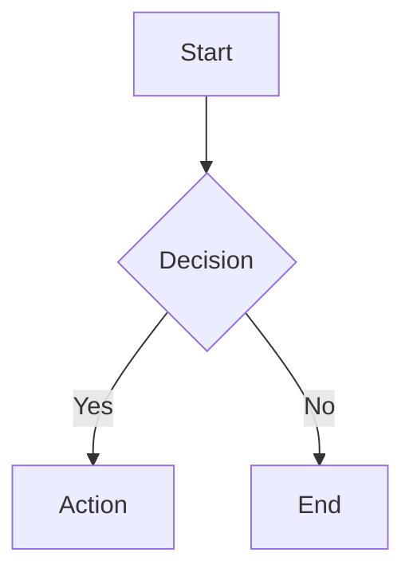
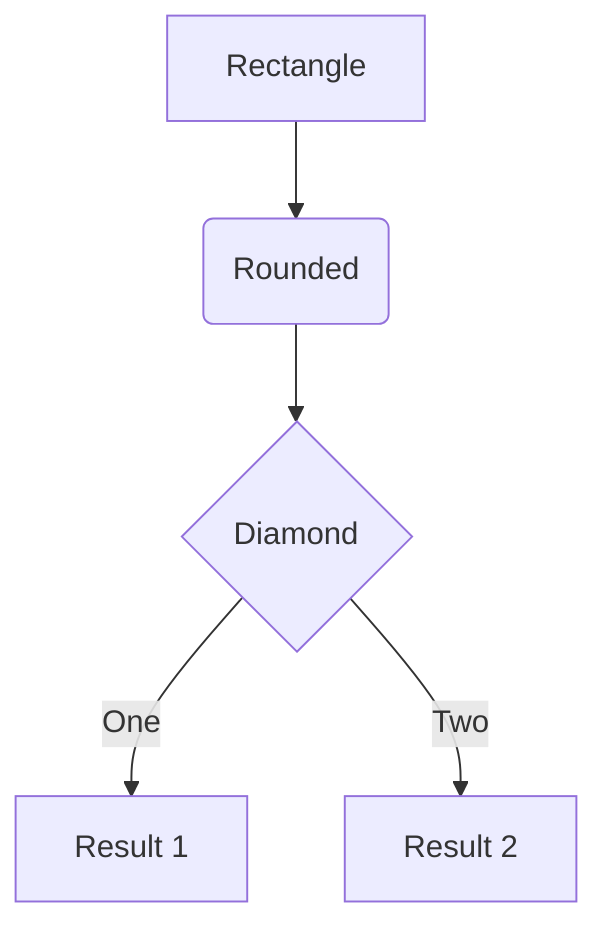
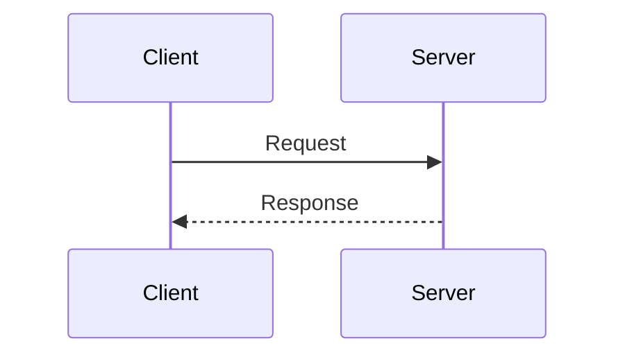
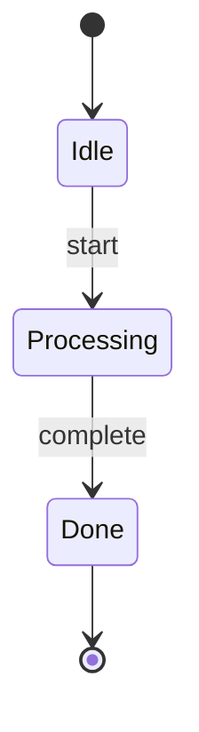
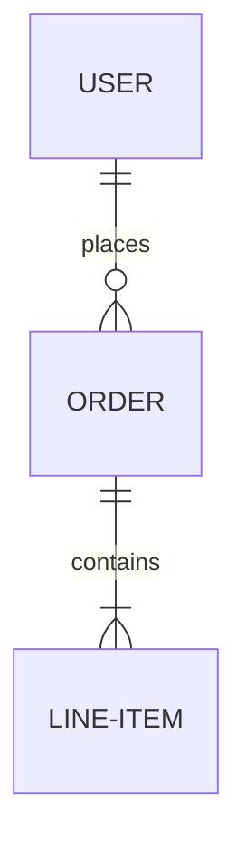

# Mermaid Diagrams

## When to Use

Use Mermaid diagrams instead of ASCII art or text-based diagrams when visualizing:

- Workflows and processes (flowchart)
- API call sequences (sequenceDiagram)
- State machines (stateDiagram-v2)
- System architecture (graph TD/LR)
- Data relationships (erDiagram)
- Class hierarchies (classDiagram)
- Timelines and Gantt charts
- Git branching (gitGraph)

## Format

Always use fenced code blocks with `mermaid` language identifier:



## Diagram Types

### Flowchart (graph)


### Sequence Diagram


### State Diagram


### Entity Relationship


## Best Practices

1. **Use clear, descriptive labels** - Node text should be self-explanatory
2. **Keep diagrams focused** - Split complex flows into multiple diagrams
3. **Use subgraphs** to group related nodes:
   ```mermaid
   graph TD
       subgraph Frontend
           A[React] --> B[State]
       end
       subgraph Backend
           C[API] --> D[DB]
       end
       B --> C
   ```
4. **Choose appropriate direction**:
   - `TD` (top-down) for hierarchies and vertical flows
   - `LR` (left-right) for sequences and horizontal processes
5. **Use styling sparingly** - Let the default theme handle most styling
